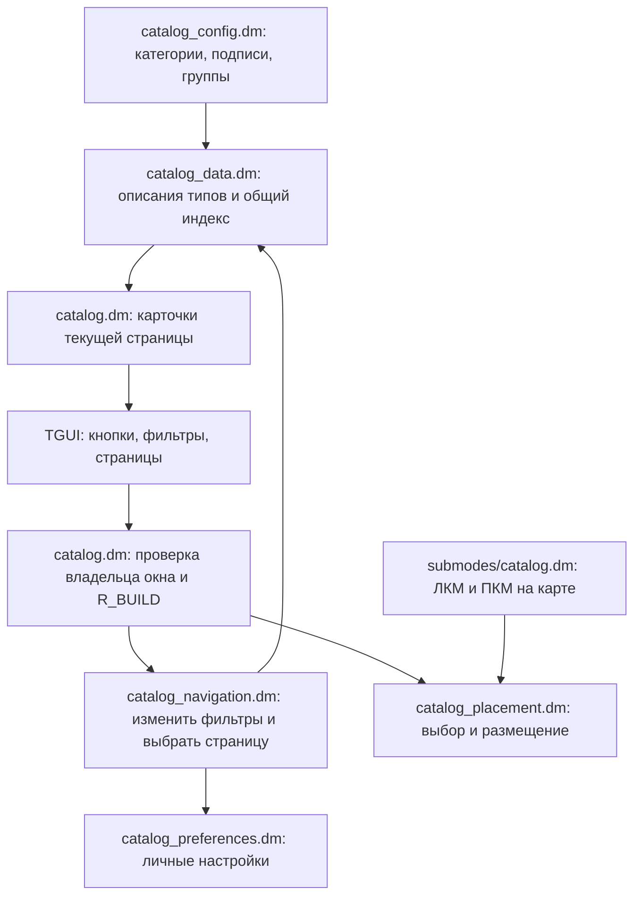

# Как устроен F7 и как его менять

F7 — обычный модуль Ratwood: сервер написан на DM, окно — на TGUI/React. ИИ не участвует в работе меню и не нужен для его сборки или изменения. Для правок используются тот же компилятор и те же инструменты, что и для остального проекта.

Модуль допускает обычные правки человеком, но не может защититься от любого изменения кода. Ниже показаны границы: какие изменения делаются настройкой, а какие требуют согласованной правки логики и тестов.

## Путь от кнопки до результата



1. При первом обращении сервер собирает описания разрешённых игровых типов. Для этого он читает исходные `name`, `icon`, `armor_class`, `body_parts_covered` и другие поля, не создавая предметы.
2. Поиск берёт только подходящую категорию или подкатегорию. Общий индекс хранится на сервере; результаты текущего поиска, выбранный предмет и избранное принадлежат конкретному администратору.
3. Окно отправляет действие, например `act('subcategory', { value: 'swords' })`. Сервер проверяет доступ и допустимость значения. Навигация обновляет личные результаты и сохранение, затем отдаёт текущую страницу.
4. Предмет создаётся только через размещение. Перед изменением мира повторно проверяются права, тип и ограничения. Первый ПКМ снимает активный спавн; без выбранного спавна ПКМ удаляет объект на карте.

## Где менять нужную часть

| Изменение | Файл |
| --- | --- |
| Категории, их подписи и порядок; состав подкатегорий; подписи классов брони и зон тела | [catalog_config.dm](../code/modules/buildmode/catalog_config.dm) |
| Размер страницы, число избранных и недавних, длина поиска, предел смещения | [buildmode.dm с ограничениями](../code/__DEFINES/buildmode.dm) |
| Цвета, шрифт, сетка и размеры панелей | [BuildMode.scss](../tgui/packages/tgui/styles/interfaces/BuildMode.scss) |
| Кнопки, фильтры, карточки и страницы | [Catalog.tsx](../tgui/packages/tgui/interfaces/BuildMode/Catalog.tsx) |
| Панель количества, направления, смещения и выдачи | [Inspector.tsx](../tgui/packages/tgui/interfaces/BuildMode/Inspector.tsx) |
| Рамка, заголовок и исходный размер окна | [BuildMode.tsx](../tgui/packages/tgui/interfaces/BuildMode.tsx) |
| Реакция на кнопки мыши на карте | [submodes/catalog.dm](../code/modules/buildmode/submodes/catalog.dm) |
| Спавн, предпросмотр и удаление | [catalog_placement.dm](../code/modules/buildmode/catalog_placement.dm) |
| Поиск и сохранение выбранной страницы | [catalog_navigation.dm](../code/modules/buildmode/catalog_navigation.dm) |
| Формат личного сохранения | [catalog_preferences.dm](../code/modules/buildmode/catalog_preferences.dm) |

Файлы `tgui.bundle.js` и `tgui.bundle.css` создаёт сборщик: редактировать следует исходные TSX/SCSS, иначе следующая сборка затрёт ручную правку.

Названия категорий и фильтров приходят в TGUI с сервера. Их не нужно повторять в TypeScript. Пределы длины поиска и смещения тоже передаются сервером. Общий предел партии `ADMIN_SPAWN_CAP` используется и другими административными инструментами проекта; его изменение имеет более широкий эффект, чем изменение одного окна F7.

## Пример: переименовать оружие в арсенал

В `buildmode_catalog_categories()` заменить только подпись:

```dm
"weapons" = "Арсенал",
```

`weapons` — постоянный идентификатор, по которому работают фильтры и сохранения. `Арсенал` — отображаемый текст. Ту же подпись автоматически получат боковая кнопка и заголовок результатов. Перестановка строк этой таблицы меняет порядок кнопок; порядок правил распределения предметов от этого не меняется.

## Пример: выделить сабли в отдельную подкатегорию

В `buildmode_catalog_groups()` внутри `groups["weapons"]` добавить запись **перед** общей группой `swords`:

```dm
"sabres" = list(
	"name" = "Сабли",
	"roots" = list(/obj/item/rogueweapon/sword/sabre),
),
```

Это пример расширения; группа «Сабли» не добавлялась в текущую конфигурацию.

Группы проверяются сверху вниз, используется первое совпадение. `/obj/item/rogueweapon/sword` включает сабли, поэтому более узкий путь должен находиться раньше него. Потомки указанного типа попадут в новую группу автоматически. Используется настоящий DM-путь без кавычек: опечатка или удалённый тип остановят компиляцию.

После такого изменения добавить проверку в `check_filters()` теста `buildmode_catalog`:

```dm
TEST_ASSERT_EQUAL(buildmode_catalog_subcategory(/obj/item/rogueweapon/sword/sabre, "weapons"), "sabres", "Sabres must use their own subgroup.")
```

Для целой новой категории нужны две правки в том же конфигурационном файле: добавить идентификатор и подпись в `buildmode_catalog_categories()`, затем вернуть этот идентификатор из подходящего условия `buildmode_catalog_category()`. Узкие условия размещаются перед общими: например, отдельный вид предметов проверяется перед `/obj/item`. При желании для новой категории добавляются подкатегории. Боковое меню и проверки допустимых идентификаторов получают новую категорию автоматически.

## Пример: изменить размер страницы или оформление

В файле ограничений можно, например, заменить:

```dm
#define BUILDMODE_PAGE_SIZE 36
```

Сервер сам пересчитает страницы и обрежет слишком большой сохранённый номер. Для цвета выделения достаточно изменить `--build-selected` в начале `BuildMode.scss`. Такие изменения не требуют правки логики размещения.

После изменения DM нужна пересборка и перезапуск сервера: общий индекс рассчитан на неизменные определения типов в течение раунда. После изменения TGUI/SCSS требуется сборка интерфейса. Прежние личные размеры окна продолжают восстанавливаться, поэтому новое значение исходного размера видно прежде всего при первом открытии без сохранённой геометрии.

## Что требует согласованного изменения

- **Идентификаторы и подписи различаются.** Переименование подписи сохраняет настройки. Переименование идентификатора категории или группы делает старое сохранённое значение неизвестным: оно будет сброшено к допустимому значению. Для сохранения старого выбора понадобится явное преобразование при загрузке.
- **Пути предметов сохраняются в избранном и истории.** После удаления или переименования типа устаревший путь отбрасывается при загрузке. Остальные настройки читаются. Сохранить связь между старым и новым предметом можно только явным преобразованием пути.
- **Действия TGUI — договор между двумя файлами.** Новому `act('...')` нужен соответствующий обработчик в `catalog.dm` и описание новых данных в `common.tsx`. Неизвестное действие сервер проигнорирует. Переименовывать действие нужно с обеих сторон.
- **Кэш общий, выбор личный.** Не менять списки из `buildmode_catalog_entries()`, `buildmode_catalog_index()` и конфигурационных функций во время работы. Они используются всеми окнами. `entry.Copy()` копирует верхний уровень, вложенные списки остаются общими. Для фильтрации следует получать собственный список результатов.
- **Изменение поиска должно обновлять кэш.** Использовать `set_catalog_navigation()`, а при новой логике фильтров — вызывать `invalidate_catalog_results()`. Иначе интерфейс может показать результат от прежнего фильтра.
- **Новая кнопка размещения должна пользоваться `place_catalog()`.** В нём находятся повторная проверка доступа, ограничения количества, направление, смещение и запись в журнал. Прямой `new` из нового обработчика обойдёт эту общую логику.

Добавление обычного предмета-потомка существующего типа обычно не требует правки F7: достаточно включить его файл в проект и собрать игру. Распределение будет определяться родительским типом, а название и спрайт — исходными полями предмета. Если внешний вид создаётся случайно в `Initialize()`, карточка показывает исходный спрайт, а не будущий случайный вариант.

## Как проверять правки

Из корня проекта в Windows:

```powershell
.\BUILD.cmd
.	oolsuilduild.bat dm-test
```

`BUILD.cmd` собирает игру и TGUI. Штатная цель `dm-test` создаёт тестовую сборку с `CIBUILDING`, включает `UNIT_TESTS` и запускает тесты проекта; это общий прогон, он может обнаружить ошибки и в других модулях. Эти команды не зависят от личной папки автора или временного стенда.

Проверки F7 находятся в [buildmode_catalog.dm](../code/modules/unit_tests/buildmode_catalog.dm). Они покрывают настройки, классификацию, порядок выдачи, кэш, сохранения, доступ, спавн и отмену ПКМ. `check_configuration()` отдельно проверяет, что категории имеют подписи, подкатегории относятся к существующим категориям, корневые пути соответствуют своим разделам, а сервер и окно используют одинаковые лимиты.

Для намеренного изменения поведения следует изменить и соответствующее ожидание теста. Не удалять падающую проверку только ради успешного результата: сначала проверить, вызвано ли падение новым замыслом или ошибкой. Компиляция и автотесты не заменяют [проверку управления в клиенте BYOND](admin-buildmode.md#проверка-в-игре).

## Как читать изменения при ревью

Начать с конфигурации и обработчика `submodes/catalog.dm`, затем пройти по действию через `catalog.dm` к навигации или размещению. После этого проверить личные сохранения и тесты. Файлы TGUI отвечают за отображение и отправку действий; сервер решает, допустимо ли действие.

Внешние точки подключения F7: создание режима и кнопок в `buildmode.dm`/`buttons.dm`, предпросмотр через `mouseover.dm`, подключения в `roguetown.dme` и `main.scss`. Запоминание размера окна добавлено через опцию `rememberSize` в общие `Window`/`drag`; для остальных окон эта опция по умолчанию выключена и отдельно проверена тестами геометрии.
