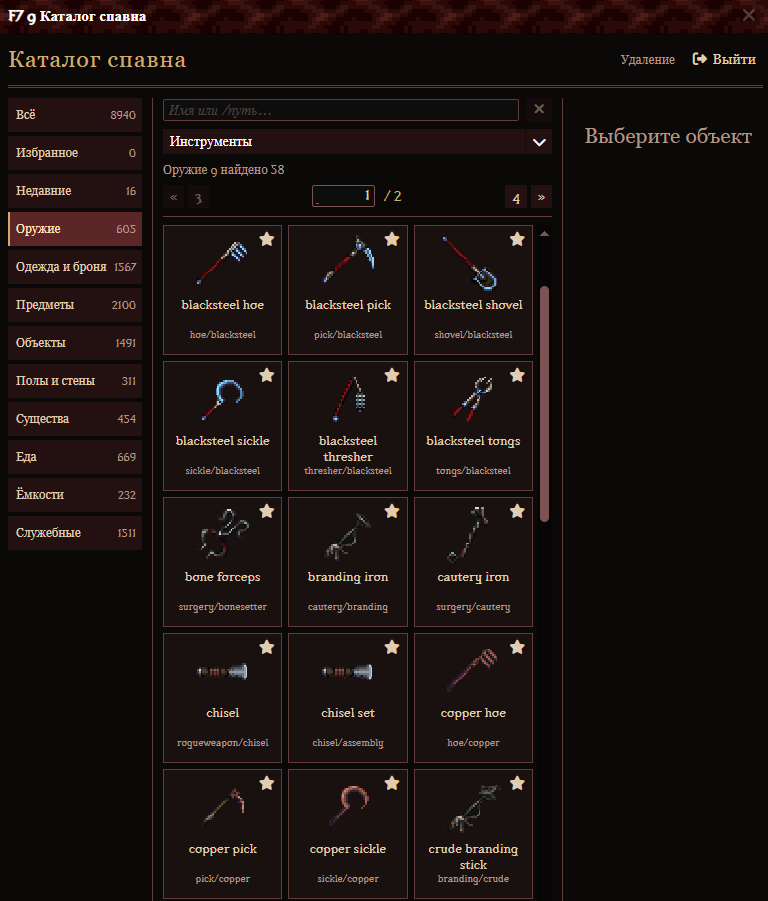

# F7: каталог спавна для администрации

F7 открывает визуальный каталог и включает режим размещения. Повторное F7 или кнопка «Выйти из F7» закрывает режим. Закрытие самого окна сохраняет выбранный объект: вернуть окно можно кнопкой каталога в верхней панели строительства.

- Поиск работает по имени и пути, без учёта регистра. Несколько слов должны встретиться в имени или пути; поиск действует внутри выбранной категории.
- Кнопки страниц и переход по номеру находятся над карточками и остаются видимыми при прокрутке.
- Размер и положение окна запоминаются для аккаунта на текущем компьютере. Категория, подкатегория, фильтры одежды, поиск и страница сохраняются для аккаунта на сервере и восстанавливаются после закрытия окна, выхода из F7 и нового входа в игру.
- Категории: всё, избранное, недавние, оружие, одежда и броня, предметы, объекты, полы и стены, существа, еда, ёмкости и реагенты, служебные объекты.
- В оружии доступны виды: мечи, двуручные мечи, ножи и кинжалы, топоры, булавы и молоты, цепы, древковое, посохи, кнуты, щиты, стрелковое и инструменты. В одежде независимо выбираются класс брони и покрываемая часть тела. Объекты разделены на мебель, хранилища, двери и ограждения, мастерские, освещение, природу и хозяйство, переходы, механизмы и украшения. Остальные основные разделы также получили подходящие группы. «Все виды» снимает ограничение подкатегории.
- Нажатие на карточку выбирает тип для повторного размещения. Повторное нажатие той же карточки снимает выбор и предпросмотр: ЛКМ больше не создаёт объекты, ПКМ продолжает удалять. ЛКМ на карте создаёт объект. Первый ПКМ при выбранном спавне отменяет установку и убирает предпросмотр, не удаляя объект под курсором. Без выбранного спавна ПКМ удаляет объект на карте или снимает верхний слой стены/пола, открывая слой под ним. Предметы на клетке сохраняются, самый нижний слой карты остаётся. Alt + ЛКМ выбирает тип существующего объекта.
- Полупрозрачный спрайт показывает клетку, направление и смещение. Для невидимых типов используется подсветка клетки. Это исходный спрайт типа; случайный облик, наложения и эффекты инициализации могут отличаться после создания.
- Справа доступны количество до 100, восемь направлений, смещение на ±32 пикселя, сброс параметров, спавн у ног и выдача предметов в свободные руки. Остальные предметы остаются на земле. Выдача в руки доступна живому персонажу администратора. Выбор снимается кнопкой «Снять выбор».
- Полы и стены заменяют одну выбранную клетку; количество и смещение к ним не применяются.
- До 100 избранных типов и 24 недавних выбора сохраняются отдельно для каждого аккаунта в `data/player_saves/<prefix>/<ckey>/buildmode.sav`. Удалённые из кода типы при чтении пропускаются.
- Старые инструменты доступны через прежнюю верхнюю панель. Их правила кликов сохраняются; выбор карточки возвращает режим каталога.

## Реализация

Каталог использует TGUI проекта и выдаёт только текущую страницу карточек. Просмотр не создаёт реальные игровые объекты. Права `R_BUILD` и принадлежность окна проверяются при действиях и непосредственно перед спавном; созданные объекты получают флаг административного спавна и запись в журнале.

[Устройство модуля, примеры кастомизации и правила совместимости](admin-buildmode-customization.md).

## Проверка в игре

1. Администратором с `R_BUILD` нажать F7, найти меч по имени и пути, выбрать карточку, закрыть окно, разместить несколько экземпляров и открыть каталог верхней кнопкой.
2. Проверить поворот и смещение предпросмотра, количество, отмену установки первым ПКМ и удаление объекта следующим ПКМ, а также Alt + ЛКМ для выбора существующего объекта. Отмена должна работать и на пустой клетке. Повторно нажать выбранную карточку: предпросмотр исчезает, ЛКМ ничего не создаёт, ПКМ по-прежнему удаляет. Двойной выбор типа с карты через Alt + ЛКМ сохраняет спавн.
3. Выдать три предмета в руки: свободные руки заполняются, остаток оказывается на земле. Повторить с занятыми руками и в наблюдателе.
4. Выбрать подкатегорию, поиск и страницу, закрыть окно и открыть верхней кнопкой; затем выйти из F7, открыть снова и перезайти в игру. Категория, подкатегория, поиск и страница должны сохраниться вместе с избранным и недавними. Повторить для одежды с классом «Лёгкая» и покрытием «Грудь»: оба фильтра восстанавливаются. При смене основной категории фильтры сбрасываются, страница становится первой.
5. Разместить стену и пол на тестовых клетках. Первый ПКМ отменяет установку, следующий снимает верхний слой. Проверить, что предметы на клетке сохраняются, а нижний слой карты не исчезает. Затем переключить старый инструмент, прочитать его помощь и вернуться в каталог выбором карточки.
6. Изменить размер и положение окна, выключить F7, открыть снова и проверить восстановление геометрии.
7. Снять права строительства и убедиться, что окно больше не выполняет команды. Выйти из режима: курсор и кнопки должны исчезнуть.

## Поддержка кода

| Файл | Ответственность |
| --- | --- |
| `code/modules/buildmode/catalog.dm` | Доступ, данные TGUI и маршрутизация действий |
| `code/modules/buildmode/catalog_config.dm` | Категории, подписи, классы брони, зоны тела и состав подкатегорий |
| `code/modules/buildmode/catalog_data.dm` | Описания типов, изображения, общие индексы и счётчики |
| `code/modules/buildmode/catalog_filters.dm` | Применение конфигурации, подготовка вариантов для UI и проверка фильтров |
| `code/modules/buildmode/catalog_navigation.dm` | Поиск, страницы и восстановление навигации |
| `code/modules/buildmode/catalog_preferences.dm` | Избранное, история и личный файл настроек |
| `code/modules/buildmode/catalog_placement.dm` | Выбор типа, предпросмотр, размещение и удаление |
| `code/modules/buildmode/submodes/catalog.dm` | Управление мышью на карте |
| `tgui/packages/tgui/interfaces/BuildMode.tsx` | Рамка окна; компоненты каталога и размещения находятся в соседней папке `BuildMode/` |

Категории и фильтры описаны на сервере один раз; окно получает их через `ui_static_data`. В конфигурации используются проверяемые компилятором пути типов. Общие ограничения вынесены в `code/__DEFINES/buildmode.dm`. Кэш описаний, индексов, счётчиков и вариантов фильтров общий и предназначен только для чтения. Личные поля карточки, включая отметку избранного, добавляются к копии описания.

Поиск перебирает кандидатов выбранной категории или подкатегории в прежнем порядке. Изменение навигации сбрасывает результаты; изменение избранного или истории сбрасывает только соответствующую личную выдачу. Неизменённые настройки повторно не записываются. Изменения сохраняются сразу, формат старых файлов сохранён. Количество предметов не влияет на изображение предпросмотра и не требует его пересоздания.

## Автоматическая проверка

Тест `code/modules/unit_tests/buildmode_catalog.dm` проверяет поиск и порядок выдачи, подкатегории, совместные фильтры брони и покрытия, страницы и восстановление навигации, старые сохранения, отсутствие конструкторов при просмотре, доступ, отмену выбора карточкой и первым ПКМ, удаление следующим ПКМ, снятие стен и полов по слоям с сохранением предметов на клетке, создание партии, ограничения, направление, смещение и отметку административного спавна. Проверки кэша покрывают немедленное обновление избранного и истории, сохранение страницы и пропуск повторной записи неизменённых настроек.

Сборка и автотесты не заменяют проверку управления в клиенте BYOND по шагам выше. Команды сборки и запуска тестов приведены в [руководстве по кастомизации](admin-buildmode-customization.md#как-проверять-правки).
